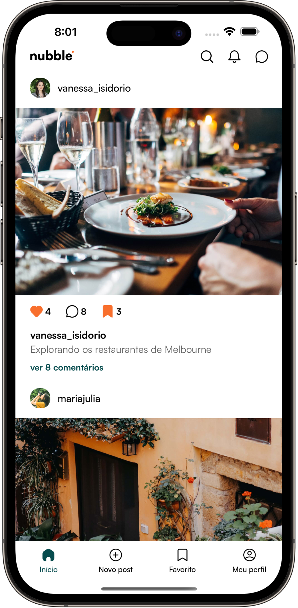
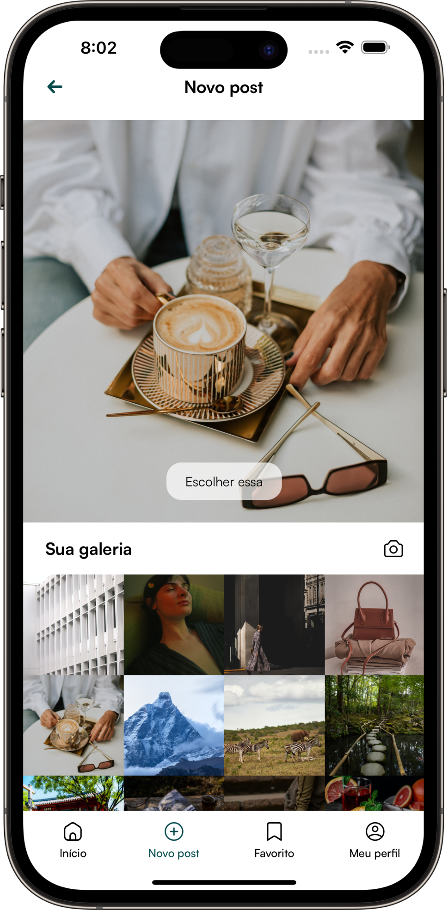
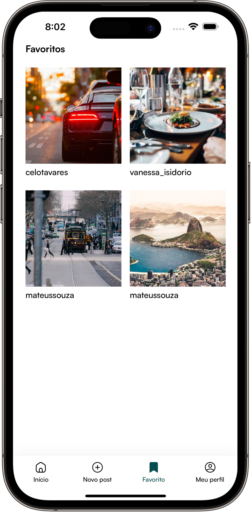
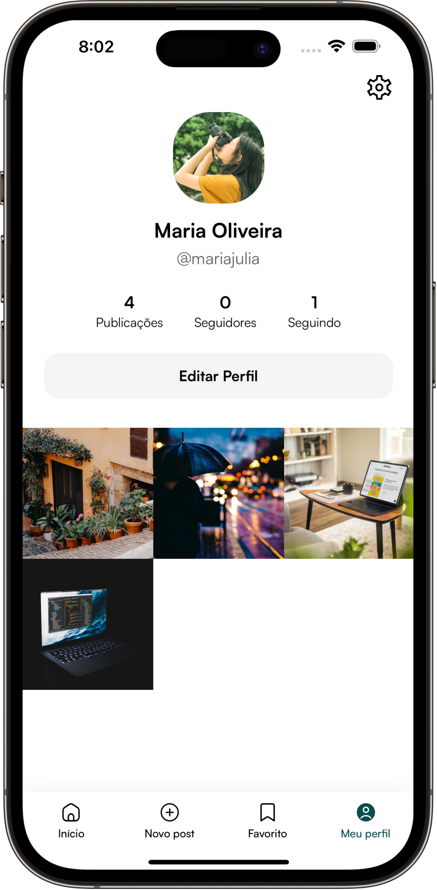
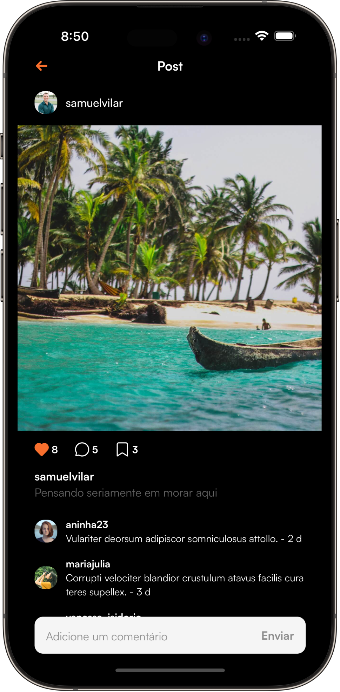
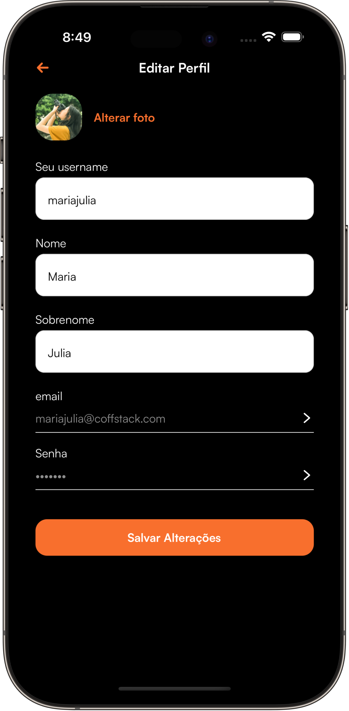
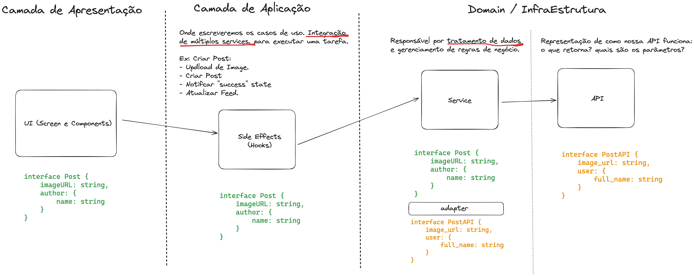

# 📱 Nubble App (Profissional React Native)

Bem-vindo ao repositório do Nubble App, o projeto construído nas aulas do curso [PRN (Profissional React Native)](https://coffstack.com.br/profissional-react-native). Ao longo do desenvolvimento você aprenderá conceitos práticos utilizados no mercado de trabalho, desde o básico até avançado, tudo isso enquanto constrói um super App com integração com Backend, **testes automatizados**, pipelines de **CI/CD** com GitHub Actions e Fastlane e muito **TypeScript**!

|                               |                               |                               |                               |
| :---------------------------: | :---------------------------: | :---------------------------: | :---------------------------: |
|  |  |  |  |
|  |  |  |  |

Confira o Figma completo com todas as tela [aqui](<https://www.figma.com/design/qZVdIhrBpXhyZCPhy1WfAh/App---Nubble-(v.1.1)?node-id=11070-1977&node-type=frame&t=QLADZp0cl379wYx4-0>)!

## ⛏️ Tech (Bibliotecas e Tecnologias)

- [React Native CLI](https://reactnative.dev/docs/getting-started-without-a-framework)
- [TypeScript](https://www.typescriptlang.org/)
- [Jest](https://jestjs.io/) e [React Native Testing Library](https://callstack.github.io/react-native-testing-library/)
- CI/CD com [Fastlane](https://fastlane.tools/) e [GitHub Actions](https://github.com/features/actions)
- [React Hook Form](https://react-hook-form.com/) e [Zod](https://zod.dev/)
- [Zustand](https://zustand.docs.pmnd.rs/getting-started/introduction)
- [TanStack Query (React Query)](https://tanstack.com/query/latest)
- [React Native MMKV](https://github.com/mrousavy/react-native-mmkv)
- [Shopify Restyle](https://shopify.github.io/restyle/)
- [React Navigation](https://reactnavigation.org/)
- [EsLint](https://eslint.org/), [Prettier](https://prettier.io/) e [Husky](https://typicode.github.io/husky/)
- [React Native Vision Camera](https://react-native-vision-camera.com/docs/guides)

## 🏗️ Arquitetura do Projeto

O Nubble App adota uma arquitetura em camadas com princípios de Clean Architecture, SOLID, design patterns e MVVM (Model-View-ViewModel). Esta estrutura, validada em projetos com milhares de usuários, visa criar apps fáceis de entender e manter, além de escaláveis em termos de base de código e equipe.

## 👨🏻‍💻 Quem é seu Professor?

**Lucas Garcez** é um especialista de destaque em React Native, com **mais de 6 anos de experiência** prática no desenvolvimento de aplicativos de alto desempenho para empresas no **Brasil e no exterior**. Reconhecido por sua capacidade única de simplificar o complexo e por sua **abordagem prática e didática**, Lucas é a referência no ensino de **React Native avançado**. Atualmente, ele reside na Austrália, onde atua como **engenheiro de software sênior**, aplicando diariamente as técnicas e conceitos que ensina. Com isso, ele oferece aos seus alunos um **conhecimento diretamente alinhado às demandas do mercado global**, tornando-se um dos poucos professores qualificados a ensinar **React Native no nível que as empresas realmente exigem**.

- [LinkedIn](https://www.linkedin.com/in/lucas-garcez-a5636b157/?locale=pt_BR)
- [GitHub](https://github.com/LucasGarcez)
- [YouTube](https://www.youtube.com/@Coffstack)
- [Instagram](https://www.instagram.com/lucasgar6/)

